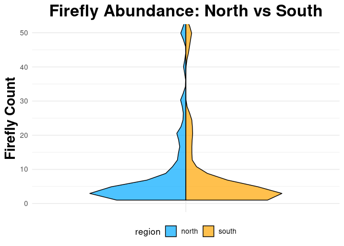

Final Project
================
Hailey Knowles
2025-11-12

- [ABSTRACT](#abstract)
- [BACKGROUND](#background)
- [STUDY QUESTION and HYPOTHESIS](#study-question-and-hypothesis)
  - [Question](#question)
  - [Hypothesis](#hypothesis)
  - [Prediction](#prediction)
- [METHODS](#methods)
  - [1st Analysis - Box Plot](#1st-analysis---box-plot)
  - [2nd Analysis - Violin Plot](#2nd-analysis---violin-plot)
  - [3rd Analysis - Quasipoisson
    Regression](#3rd-analysis---quasipoisson-regression)
- [DISCUSSION](#discussion)
  - [Interpretation of 1st Analysis (Box
    Plot)](#interpretation-of-1st-analysis-box-plot)
  - [Interpretation of 2nd Analysis (Violin
    Plot)](#interpretation-of-2nd-analysis-violin-plot)
  - [Interpretation of 3rd Analysis (Quasipoisson
    Regression)](#interpretation-of-3rd-analysis-quasipoisson-regression)
- [CONCLUSION](#conclusion)
- [REFERENCES](#references)

# ABSTRACT

Fill in abstract… Write this last, after finishing methods, results, and
discussion. Summarize the overall study question, approach, results, and
conclusion in a short paragraph.

# BACKGROUND

Fireflies are a very interesting species that many researchers want to
look into due to their glowing abilities. They are classified in the
Lampyridae family of insects. According to firefly conservation and
research there are 2400 firefly species in 144 genera (Firefly
conservation and research, 2025). According to a study conducted in 2023
it was determined that water is a vital source for fireflies and it is
required for them to thrive in their various environments. Fireflies
have a preference for areas with high humidity and constant moisture.
They also prefer areas with abundant trees and various types of grasses
(Qing & Lin, 2023). Fireflies need to lay their eggs in most soil or
even in damp tree trunks. Many fireflies are found in tropical regions,
but there are a few fireflies that can be found in dry forests or arid
environments, but only during the rainy seasons. These fireflies can be
found in every part of the world except for Antarctica. These kinds of
conditions are more common in the Northern areas of Utah instead of the
Southern areas of Utah (Grimaldi, 2025).

There is a wide variety of climates within the state of Utah and some of
these variations are based on Norther and Southern areas. The more South
you move, the less rainfall you see and a smaller amount of green
vegetation. Utah is an arid climate that has very little rainfall
accumulate annually and can receive less than 15 inches of rain in a
year and was found that the Northern areas of Utah tend to be cooler on
average than the Southern Utah regions. During the whole year there is a
tendency for the Northern regions of Utah to also receive more rain than
the Southern regions (GottAgoUtah_admin, 2024).

# STUDY QUESTION and HYPOTHESIS

## Question

Does the location (Northern or Southern counties) of the fireflies
affect the level of abundance of fireflies in Utah?

## Hypothesis

We hypothesize that Northern counties in Utah will have a higher overall
abundance than compared to Southern counties due to a lower overall
temperature in the Northern counties and a higher abundance of green
vegetation and rainfall when compared to the Southern counties.

## Prediction

We predict that Northern counties in Utah will have a higher overall
abundance than compared to Southern counties. A possible test statistic
is a quasipoisson regression. This would allow us to compare the two
variables of north and south abundance values to determine which one has
a higher abundance and if the difference is significant.

# METHODS

The data that was used for this research project was collected from a
firefly observation project conducted in various locations around Utah.
The exact locations of the observations were hidden due to the
protection of privacy. The data was then organized by county, abundance
count, date and had individualized notes about where the fireflies were
seen and the type of environment.

The data sheet that was filled-out and organized by our research team in
a way that allowed the running of various tests and allowed the plots to
be created. Each county in Utah within the data set was assigned to be
either North or South based on distinctions made by our research team on
what constituted as North or South. The distinction made was that any
county that was inline with Carbon county or lower would be considered a
Southern county and anything above would be considered a Northern
county.

The plots created based on the data was a box plot and a violin plot.
The box plot allows us to visualize the data in a way to compare the
mean values and distribution for both North and South. The other plot is
a violin plot which allows the visualization of the distribution of the
abundance of fireflies based on being located in the North or South
counties. The final statistical analysis that was ran was a quasipoisson
regression which allowed the test to assume that the data distribution
was not normal and had a skewed tail. It compares all the values in the
data set and determines if the difference is significant or not
significant.

## 1st Analysis - Box Plot

This is a box plot that allows the visualization of the various aspects
of the data set comparing the abundance of fireflies in Northern and
Southern counties in Utah. It allows the visual comparison of the mean,
max, min and outliers.

``` r
# Firefly Boxplot (Log-Transformed, No Blanks)

library(ggplot2)

# Read in the data
fireflies <- read.csv("Copy of firefliesUtah - Usable Data.csv", stringsAsFactors = FALSE)
colnames(fireflies) <- c("firefly_count", "region")

# Remove blank or missing region values
fireflies <- subset(fireflies, region != "" & !is.na(region))

# Box plot with log10 transformation (+1 to avoid log(0))
ggplot(fireflies, aes(x = region, y = log10(firefly_count + 1), fill = region)) +
geom_boxplot(width = 0.6, color = "black", alpha = 0.7) +
labs(
title = "Firefly Abundance by Region (Log Scale)",
x = "Region",
y = "Log-Transformed Firefly Count"
) +
scale_fill_manual(values = c("north" = "#00A9FF", "south" = "orange")) +
theme_minimal(base_size = 13) +
theme(
legend.position = "none",
plot.title = element_text(size = 16, face = "bold", hjust = 0.5),
axis.text = element_text(size = 12),
axis.title = element_text(size = 13),
panel.grid.major.x = element_blank(),
panel.grid.minor = element_blank()
)
```

    ## Warning: Removed 1 row containing non-finite outside the scale range
    ## (`stat_boxplot()`).

<!-- -->

## 2nd Analysis - Violin Plot

This is a violin plot that expresses the data in a visual way to compare
the distributions of the firefly abundance in Northern and Southern
counties. The distribution is important to understand and look at
side-by-side because then you can see what is the most common number of
abundance observations.

``` r
# Split Violin Plot (y-axis limited to 50) and downloaded the necessary library packages

library(ggplot2)
library(gghalves)
library(stringi)

# Read and cleaned the data
fireflies <- read.csv("Copy of firefliesUtah - Usable Data.csv", stringsAsFactors = FALSE)
colnames(fireflies) <- c("firefly_count", "region")

fireflies$region[fireflies$region == ""] <- NA
fireflies$region <- stri_trans_general(fireflies$region, "NFKC")
fireflies$region <- stri_replace_all_regex(fireflies$region, "\\p{C}", "")
fireflies$region <- gsub("\u00A0", " ", fireflies$region)
fireflies$region <- trimws(tolower(fireflies$region))
fireflies$region[fireflies$region %in% c("n", "nrth", "noth")] <- "north"
fireflies$region[fireflies$region %in% c("s", "sth", "soth")] <- "south"
fireflies$region <- factor(fireflies$region, levels = c("north", "south"))
fireflies_clean <- droplevels(subset(fireflies, !is.na(region)))

# Split the violin plot
ggplot() +
geom_half_violin(
data = subset(fireflies_clean, region == "north"),
aes(x = factor(1), y = firefly_count, fill = region),
side = "l", trim = TRUE, color = "black", alpha = 0.7
) +
geom_half_violin(
data = subset(fireflies_clean, region == "south"),
aes(x = factor(1), y = firefly_count, fill = region),
side = "r", trim = TRUE, color = "black", alpha = 0.7
) +
scale_fill_manual(values = c("north" = "#00A9FF", "south" = "orange")) +
coord_cartesian(ylim = c(0, 50)) + # y-axis capped at 50
labs(
title = "Firefly Abundance: North vs South",
x = NULL,
y = "Firefly Count"
) +
theme_minimal(base_size = 13) +
theme(
legend.position = "bottom",
plot.title = element_text(size = 16, face = "bold", hjust = 0.5),
axis.text.x = element_blank(),
axis.ticks.x = element_blank()
)
```

    ## Warning: Removed 1 row containing non-finite outside the scale range
    ## (`stat_half_ydensity()`).

<!-- -->

## 3rd Analysis - Quasipoisson Regression

This is a quasipoisson regression analysis that is comparing the values
of firefly abundance in the two groups (Northern and Southern counties
in Utah) to see if they are statistically different from each other or
not. In this case with a p-value of 0.00344 we can understand that there
is a statistically significant difference between these two groups with
the Southern counties being of higher value.

``` r
# Read in the data
fireflies <- read.csv("Copy of firefliesUtah - Usable Data.csv", stringsAsFactors = FALSE)
colnames(fireflies) <- c("firefly_count", "region")

# Remove blank or missing region values
fireflies <- subset(fireflies, region != "" & !is.na(region))

# Poisson regression
poisson_model <- glm(firefly_count ~ region, data = fireflies, family = "poisson")

# Summary of the model
summary(poisson_model)
```

    ## 
    ## Call:
    ## glm(formula = firefly_count ~ region, family = "poisson", data = fireflies)
    ## 
    ## Coefficients:
    ##             Estimate Std. Error z value Pr(>|z|)    
    ## (Intercept)  2.62561    0.01293  203.06   <2e-16 ***
    ## regionsouth  1.13788    0.02340   48.63   <2e-16 ***
    ## ---
    ## Signif. codes:  0 '***' 0.001 '**' 0.01 '*' 0.05 '.' 0.1 ' ' 1
    ## 
    ## (Dispersion parameter for poisson family taken to be 1)
    ## 
    ##     Null deviance: 30429  on 493  degrees of freedom
    ## Residual deviance: 28450  on 492  degrees of freedom
    ##   (1 observation deleted due to missingness)
    ## AIC: 30188
    ## 
    ## Number of Fisher Scoring iterations: 7

``` r
# Exponentiated coefficients (rate ratios)
exp(coef(poisson_model))
```

    ## (Intercept) regionsouth 
    ##   13.812933    3.120145

``` r
# Check for overdispersion
dispersion <- sum(residuals(poisson_model, type = "pearson")^2) / poisson_model$df.residual
dispersion # If > 1.5, overdispersion may be present
```

    ## [1] 273.6239

``` r
# Quasi-Poisson if overdispersion
quasi_model <- glm(firefly_count ~ region, data = fireflies, family = "quasipoisson")
summary(quasi_model)
```

    ## 
    ## Call:
    ## glm(formula = firefly_count ~ region, family = "quasipoisson", 
    ##     data = fireflies)
    ## 
    ## Coefficients:
    ##             Estimate Std. Error t value Pr(>|t|)    
    ## (Intercept)   2.6256     0.2139   12.28  < 2e-16 ***
    ## regionsouth   1.1379     0.3871    2.94  0.00344 ** 
    ## ---
    ## Signif. codes:  0 '***' 0.001 '**' 0.01 '*' 0.05 '.' 0.1 ' ' 1
    ## 
    ## (Dispersion parameter for quasipoisson family taken to be 273.6309)
    ## 
    ##     Null deviance: 30429  on 493  degrees of freedom
    ## Residual deviance: 28450  on 492  degrees of freedom
    ##   (1 observation deleted due to missingness)
    ## AIC: NA
    ## 
    ## Number of Fisher Scoring iterations: 7

``` r
# Add predicted counts to the data
fireflies$predicted_count <- predict(poisson_model, newdata = fireflies, type = "response")
```

# DISCUSSION

Given the results from the box plot, violin plot, and the quasipoisson
regression we can conclude that there is a statistically significant
difference between the abundance of fireflies observed in both the
Northern and Southern counties in Utah.

## Interpretation of 1st Analysis (Box Plot)

The box plot shows information that compares the means, min, max and the
1st and 3rd quartiles. All of this information can not, on its own,
support the hypothesis stated above that the Northern counties in Utah
would have a higher overall abundance of fireflies than the Southern
counties. This visually shows the means of the two groups and as can be
seen we understand that the means are very similar but the Southern
means are slightly larger than the Northern means.

## Interpretation of 2nd Analysis (Violin Plot)

This violin plot gives another visual representation of the data
collected. It allows the observation counts to be seen side-by-side to
see the distribution of abundance between the Northern and Southern
counties in Utah. As seen in the plot there is a cluster of abundance
around four fireflies seen in the observations collected. The Northern
counts have high spikes in abundance that make the counts less
consistant. The Southern counties on the other hand have a very gradual
increase in counts and is more consistant than the Northern
observations.

## Interpretation of 3rd Analysis (Quasipoisson Regression)

Based on the quasipoisson regression we can confirm that there is no
correlation between the two different groups. The p-value given in these
analysis was 0.00344, and this gives a significant distinction between
the Northern and Southern counties in Utah in which the Southern
county’s counts were higher than the Northern counties. The quasipoisson
regression allows the program to understand that our data isn’t normally
distributed and that both the North and South regions have long tails
that can disrupt these distributions. The Southern region has a more
average count while the Northern region has super high firefly
population booms that lengthen the tail and disrupt the distribution
even more.

# CONCLUSION

Based on the evidence collected there is no support for the original
hypothesis that there will be a higher overall observation abundance in
the Northern counties in Utah compared to the Southern counties. Each
analysis ran showed that there is a significant difference between the
mean abundance measurements and that a significant conclusion can be
drawn, but in the opposite direction as the original hypothesis stated.
The Southern counties were found to have a statistically significant
higher number for observations compared to the Northern counties in
Utah. There were many limitations that occurred during this experiment.
This data was collected from various locations in Utah but the exact
location of the sightings were undisclosed and cannot be exact. Another
uncertainty was the way that they data was collected. There were many
observations that were collected by other observers and cannot be
counted on to be exactly accurate and many of the observation numbers
should be considered approximate and not exact due to the difficulty of
actually counting the flying fireflies. The counts in Northern and
Southern counties might be inaccurate due to the Northern counties
having exponentially more observation counts compared to the Southern
counties observations. The data used in this experiment fails to support
the original hypothesis, and future studies should still be conducted to
determine the different between climates and its impact on firefly
observation counts.

# REFERENCES

1.  ChatGPT. OpenAI, version Jan 2025. Used as a reference for functions
    such as plot() and to correct syntax errors. Accessed 2025-11-12.

2.  Firefly Life Cycle & Habitat: Lightning bug facts. Orkin. (n.d.).
    <https://www.orkin.com/pests/beetles/fireflies>

3.  GottAgoUtah_admin. (2024, December 9). Understanding Utah’s
    year-round weather conditions. Gotta Go Utah !
    <https://www.gottagoutah.org/understanding-utahs-year-round-weather-conditions/>

4.  Shen, M., Qing, Z., & Lin, S. (2023). The Impact of Environment
    Situation on Fireflies and the Contribution of Fireflies on
    Environment Situation.

5.  Types of fireflies. Firefly Conservation & Research. (2023, March
    27). <https://www.firefly.org/types-of-fireflies.html>

6.  West, F. L. R., & Edlefsen, N. E. (1919). The climate of Utah
    (No. 166). Utah Agricultural College Experiment Station.
