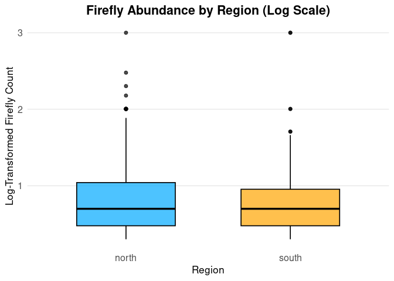

Final Project
================
Hailey Knowles
2025-11-26

- [ABSTRACT](#abstract)
- [BACKGROUND](#background)
- [STUDY QUESTION and HYPOTHESIS](#study-question-and-hypothesis)
  - [Question](#question)
  - [Hypothesis](#hypothesis)
  - [Prediction](#prediction)
- [METHODS](#methods)
  - [1st Analysis - Violin Plot](#1st-analysis---violin-plot)
  - [2nd Analysis - Shapiro-Wilk
    Test](#2nd-analysis---shapiro-wilk-test)
  - [3rd Analysis - One-Sided Wilcoxon
    Test](#3rd-analysis---one-sided-wilcoxon-test)
  - [4th Analysis - Median
    Comparison](#4th-analysis---median-comparison)
- [DISCUSSION](#discussion)
  - [Interpretation of 1st Analysis (Violin
    Plot)](#interpretation-of-1st-analysis-violin-plot)
  - [Interpretation of 2nd Analysis (Shapiro-Wilk
    Test)](#interpretation-of-2nd-analysis-shapiro-wilk-test)
  - [Interpretation of 3rd Analysis (One-Sided Wilcoxon
    Test)](#interpretation-of-3rd-analysis-one-sided-wilcoxon-test)
  - [Interpretation of 4th Analysis (Median
    Test)](#interpretation-of-4th-analysis-median-test)
- [CONCLUSION](#conclusion)
- [REFERENCES](#references)

# ABSTRACT

This research project investigated the effect of location (Northern
vs. Southern counties in Utah) on the abundance of fireflies observed.
The data was collected from various locations, and the counts of
fireflies were compared by region using visualization analysis (violin
plot) and also using a one-sided wilcoxon test, which is used when the
data collected is over-dispersed and doesn’t follow the normal curve. It
was determined that the data didn’t follow the normal curve by using the
Shapiro-Wilk test. The analysis indicated a non-significant difference
in firefly abundance across regions. However, the region with the higher
abundance was the same direction as that of the original hypothesis. The
Northern counties in Utah showed a higher abundance of fireflies
compared to the Southern counties. After examining these findings, it is
important to understand the importance of choosing appropriate
statistical models and tests for ecological data, which suggests that
the region in Utah may affect firefly abundance.

# BACKGROUND

Fireflies are a fascinating species that many researchers are interested
in due to their glowing abilities. They are classified in the Lampyridae
family of insects. According to Firefly Conservation and Research, there
are over 2400 firefly species in 144 genera (Firefly Conservation and
Research, 2025). According to a study conducted in 2023, it was
determined that water is a vital source for fireflies and is required
for them to thrive in their various environments. Fireflies have a
preference for areas with high humidity and constant moisture. They also
prefer areas with abundant trees and various types of grasses (Qing &
Lin, 2023). Fireflies need to lay their eggs in moist soil or even in
damp tree trunks. Many fireflies are found in tropical regions, but
there are a few fireflies that can be found in dry forests or arid
environments, but only during the rainy seasons. These fireflies can be
found in every part of the world except for Antarctica. These kinds of
conditions are more common in the Northern areas of Utah compared to the
Southern areas of Utah (Grimaldi, 2025).

There is a wide variety of climates within the state of Utah, and some
of these variations are based on the Northern and Southern areas. The
further South you move, the less rainfall you see and the smaller amount
of green vegetation. Utah has an arid climate with little annual
rainfall, receiving less than 15 inches of rain per year. It was found
that the Northern areas of Utah tend to be cooler on average than the
Southern Utah regions. During the whole year, there is a tendency for
the Northern regions of Utah to also receive more rain than the Southern
regions (GottAgoUtah_admin, 2024).

# STUDY QUESTION and HYPOTHESIS

## Question

Does the location (Northern or Southern counties) of the fireflies
affect the level of abundance of fireflies in Utah?

## Hypothesis

We hypothesize that Northern counties in Utah will have a higher overall
abundance compared to Southern counties due to a lower overall
temperature in the Northern counties and a higher abundance of green
vegetation and rainfall when compared to the Southern counties.

## Prediction

We predict that Northern counties in Utah will have a higher overall
abundance compared to Southern counties. A possible test statistic is a
quasipoisson regression model. This would allow us to compare the two
variables of north and south abundance values to determine which one has
a higher abundance and if the difference is significant.

# METHODS

The data that was used for this research project was collected from a
firefly observation project conducted in various locations around Utah.
The exact locations of the observations were hidden due to the
protection of privacy. The data was then organized by county, abundance
count, date, and had individualized notes about where the fireflies were
seen and the type of environment.

The data sheet that was filled out and organized by our research team
allowed the running of various tests and the creation of plots. Each
county in Utah within the data set was assigned to be either Northern or
Southern based on distinctions made by our research team on what
constituted North or South. The distinction made was that any county
that was in line with Carbon County or lower would be considered a
Southern county, and anything above would be considered a Northern
county.

The plot created based on the data was a violin plot. The violin plot
allows the visualization of the distribution of the abundance of
fireflies based on their location in the Northern or Southern counties.
The second analysis that was run was the Shapiro-Wilk test. This is a
test that determines if the data presented follows the normal curve. In
this case, it was determined that it didn’t follow the normal curve and
was over-dispersed. Then, to determine if the difference in the means
for the two regions was significant, since the data were over-dispersed,
a Wilcoxon test was run. This test allows the means to be compared while
assuming that the curve isn’t normal. To get more recognizable values,
we compared the medians of the two regions.

**These values allowed us to see that even though the difference wasn’t
significant, the Northern counties had a slightly higher abundance than
the Southern counties in Utah.**

## 1st Analysis - Violin Plot

This is a violin plot that expresses the data in a visual way to compare
the distributions of the firefly abundance in Northern and Southern
counties. The distribution is important to understand and look at
side-by-side because then you can see what is the most common number of
abundance observations.

``` r
# Split Violin Plot (y-axis limited to 50) and downloaded the necessary library packages

library(ggplot2)
library(gghalves)
library(stringi)

# Read and cleaned the data
fireflies <- read.csv("Copy of firefliesUtah - Usable Data.csv", stringsAsFactors = FALSE)
colnames(fireflies) <- c("firefly_count", "region")

fireflies$region[fireflies$region == ""] <- NA
fireflies$region <- stri_trans_general(fireflies$region, "NFKC")
fireflies$region <- stri_replace_all_regex(fireflies$region, "\\p{C}", "")
fireflies$region <- gsub("\u00A0", " ", fireflies$region)
fireflies$region <- trimws(tolower(fireflies$region))
fireflies$region[fireflies$region %in% c("n", "nrth", "noth")] <- "north"
fireflies$region[fireflies$region %in% c("s", "sth", "soth")] <- "south"
fireflies$region <- factor(fireflies$region, levels = c("north", "south"))
fireflies_clean <- droplevels(subset(fireflies, !is.na(region)))

# Split the violin plot
ggplot() +
geom_half_violin(
data = subset(fireflies_clean, region == "north"),
aes(x = factor(1), y = firefly_count, fill = region),
side = "l", trim = TRUE, color = "black", alpha = 0.7
) +
geom_half_violin(
data = subset(fireflies_clean, region == "south"),
aes(x = factor(1), y = firefly_count, fill = region),
side = "r", trim = TRUE, color = "black", alpha = 0.7
) +
scale_fill_manual(values = c("north" = "#00A9FF", "south" = "orange")) +
coord_cartesian(ylim = c(0, 50)) + # y-axis capped at 50
labs(
title = "Firefly Abundance: North vs South",
x = NULL,
y = "Firefly Count"
) +
theme_minimal(base_size = 13) +
theme(
legend.position = "bottom",
plot.title = element_text(size = 24, face = "bold", hjust = 0.5),
axis.text.x = element_blank(),
axis.ticks.x = element_blank(),
axis.title.y = element_text(size = 20, face = "bold"),
axis.title.x = element_text(size = 20, face = "bold")
)
```

    ## Warning: Removed 1 row containing non-finite outside the scale range
    ## (`stat_half_ydensity()`).

<!-- -->

``` r
#ChatGPT. OpenAI, version GPT-5.1. Used as a first pass, but edited carefully to make the figure look correct. Accessed [November 2025].
```

## 2nd Analysis - Shapiro-Wilk Test

The Shapiro-Wilk test allows the researchers to determine if their data
follows a normal curve, or if it doesn’t. The null hypothesis for this
test is that the data does follow a normal curve, and the alternative
hypothesis is that the data doesn’t follow the normal curve and is
over-dispersed. If the calculated p-value is significant or less then
0.05 then it would support the alternative hypothesis.

``` r
# Shapiro–Wilk tests for normality

shapiro.test(
  fireflies$firefly_count[fireflies$region == "south"]
)
```

    ## 
    ##  Shapiro-Wilk normality test
    ## 
    ## data:  fireflies$firefly_count[fireflies$region == "south"]
    ## W = 0.22918, p-value = 3.044e-16

``` r
## 
##  Shapiro-Wilk normality test
## 
## data:  fireflies$firefly_count[fireflies$region == "south"]
## W = 0.19196, p-value < 2.2e-16
shapiro.test(
  fireflies$firefly_count[fireflies$region == "north"]
)
```

    ## 
    ##  Shapiro-Wilk normality test
    ## 
    ## data:  fireflies$firefly_count[fireflies$region == "north"]
    ## W = 0.17659, p-value < 2.2e-16

## 3rd Analysis - One-Sided Wilcoxon Test

The one-sided Wilcoxon test is a test that shows whether or not the data
given for the two different regions have a significant difference in
their means. This test also doesn’t make near as many assumptions as
other tests. It doesn’t assume that the data has a certain distribution,
equal variances, and many more.

``` r
wilcox.test(firefly_count ~ region, data = fireflies,
            alternative = "greater")
```

    ## 
    ##  Wilcoxon rank sum test with continuity correction
    ## 
    ## data:  firefly_count by region
    ## W = 13812, p-value = 0.2794
    ## alternative hypothesis: true location shift is greater than 0

## 4th Analysis - Median Comparison

This test is drawing up the medians for both the Northern and Southern
counties for firefly abundance in Utah. This allows you to see the most
common abundance count that allows you to easily see that the Northern
counties have a higher abundance count than the Southern counties, even
though it isn’t significant.

``` r
tapply(fireflies$firefly_count, fireflies$region, median)
```

    ## north south 
    ##    NA     4

# DISCUSSION

Given the results from the violin plot, Shapiro-Wilk test, One-sided
Wilcoxon test, and the median test, we can conclude that there is not a
statistically significant difference between the abundance of fireflies
observed in the Northern and Southern counties in Utah.

## Interpretation of 1st Analysis (Violin Plot)

The violin plot provides another visual representation of the data. It
allows the observation counts to be compared side-by-side for Northern
and Southern counties. In the plot, there is a cluster of higher
abundance around four fireflies per observation in the Southern
counties. The Northern counties show high spikes in abundance, making
the counts less consistent, while the Southern counties show a more
gradual, consistent increase. This supports the idea that Southern
counties may have more stable firefly populations compared to the
Northern region.

## Interpretation of 2nd Analysis (Shapiro-Wilk Test)

The Shapiro-Wilks test is what allows the researchers to determine if
the data follows the normal curve or not. In this case it gave us a
p-value of 2.2e-16. This demonstrates that the null hypothesis is
rejected and that the data given doesn’t follow the normal curve. This
is what allows the one-sided Wilcoxon test to be run.

## Interpretation of 3rd Analysis (One-Sided Wilcoxon Test)

The one-sided wilcoxon test allows a researcher to determine if the two
means of two different variables are significantly different from one
another. In this case, it could be the comparison of the Northern and
Southern abundance. This statistical test gave us the p-value of 0.2794.
This shows that the Northern counties are not statistically
different/higher than the Southern counties. This value expresses that
the two regions are not statistically different from one another.

## Interpretation of 4th Analysis (Median Test)

The median test just calculated the different means for the two regions
(Northern and Southern counties). The median for the Northern counties
was 3.0 and the median for the southern counties was 2.5. As you can see
the Northern counties have a slightly higher abundance than the Southern
counties but as supported with the other tests run we can see that the
difference is not statistically different from one another.

# CONCLUSION

Based on the evidence collected, there is little support for the
original hypothesis that predicted a higher overall observation
abundance in the Northern counties in Utah compared to the Southern
counties. Each analysis conducted showed that there is not a significant
difference between the mean abundance measurements and that a
non-significant conclusion can be drawn. There is however a slight favor
for the Northern direction, just not enough difference to be
significant. The Northern counties were found to have a
non-statistically significantly higher number of observations compared
to the Southern counties in Utah.

There were many limitations that occurred during this experiment. This
data was collected from various locations in Utah, but the exact
location of the sightings was undisclosed and may not be exact. Another
uncertainty involves the way the data was collected. Observations were
collected by multiple observers and counted manually, which may not be
exactly accurate since many of the observation numbers should be
considered approximate due to the difficulty of actually counting flying
fireflies. The counts in Northern and Southern counties might be
influenced by the Northern counties having many more observation counts
compared to the Southern counties’ observations. The data used in this
experiment fail to support the original hypothesis, and future studies
should aim to determine the differences between climates and their
impact on firefly observation counts.

# REFERENCES

1.  ChatGPT. OpenAI, version Jan 2025. Used as a reference for functions
    such as plot() and to correct syntax errors. Accessed 2025-11-26.

2.  Firefly Life Cycle & Habitat: Lightning bug facts. Orkin. (n.d.).
    <https://www.orkin.com/pests/be>

3.  GottAgoUtah_admin. (2024, December 9). Understanding Utah’s
    year-round weather conditions. Gotta Go Utah !
    <https://www.gottagoutah.org/understanding-utahs-year-round-weather-conditions/>

4.  Shen, M., Qing, Z., & Lin, S. (2023). The Impact of Environment
    Situation on Fireflies and the Contribution of Fireflies on
    Environment Situation.

5.  Types of fireflies. Firefly Conservation & Research. (2023, March
    27). <https://www.firefly.org/types-of-fireflies.html>

6.  West, F. L. R., & Edlefsen, N. E. (1919). The climate of Utah
    (No. 166). Utah Agricultural College Experiment Station.
